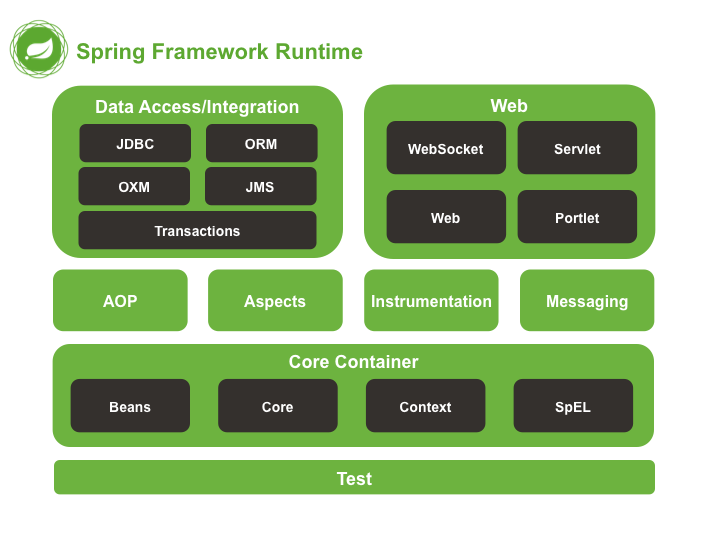
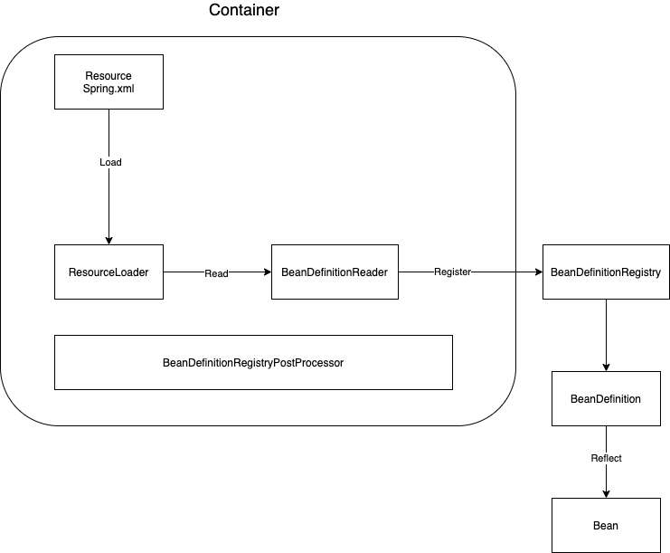
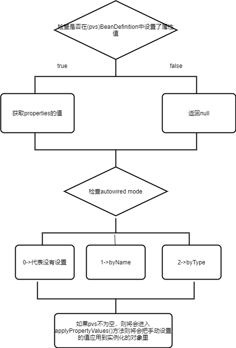

# Spring 整体架构图


# IOC 概念
## 官网原文
IOC is also known as dependency injection(DI). It is a process whereby objects define their dependencies (that is, the other objects they work with) only through constructor arguments, arguments to a factory method, or propertied that are set on the object instance after it is constructed or returned from a factory method. The container then injects those dependencied when it creates the bean. This process is fundamentally the inverse (hence the namem, Inversion of Control) of the bean itself controlling the instantiation or location of its dependencies by using direct construction of classes or a mechanism such as the Service Locator pattern.

**IoC**(Inversion of Control) 也称为**依赖注入**(dependency injection, DI)。它是一个==对象定义依赖关系的过程==，也就是说，对象只通过构造函数参数、工厂方法的参数或对象实例构造或从工厂方法返回后在对象实例上设置的属性来定义它们所使用的其他对象。然后==容器在创建bean时注入这些依赖项==。这个过程基本上是bean的逆过程，因此称为**控制反转**(IoC)

IoC容器：通过容器统一对象的构建方式，并且自动维护对象的依赖关系。
## IOC 容器工作流程(以XML为例)

1. ResourceLoader 加载 XML文件中定义的bean
2. BeanDefinitionReader 读取Resource Loader 中的 bean信息
3. BeanDefinitionRegistry 注册bean信息
4. BeanDefinition 获取注册的bean信息。 所有的bean definition将缓存到 ConcurrentHashmap (BeanDefinitionMap) key: beanName, value: beanDefinition。单例池中存储所有单例bean的信息(key: beanName, value: bean object)
5. 通过反射调用bean

# 依赖注入
方式：
* 通过XML手动注入
* 自动注入（1. XML的autowire自动注入，2.@Autowired 注解自动注入）

## XML 方式手动注入
XML 样例
* 可以手动指定注入方式为byType 或者 byName
* byType 根据类中定义的set方法进行寻找注入
* byName 根据 set 方法的名字进行寻找(通过截取set方法名后面的名字进行寻找)
```java
<bean name="orderService" class="com.carl.sectiontwo.service.OrderService">

</bean>

<bean name="userService" class="com.carl.sectiontwo.service.UserService" autowire="byType">

</bean>
```

指定某一个属性的值
```java
<bean name="userService" class="com.carl.sectiontwo.service.UserService">
	<property name="orderService" ref="orderService"/>
</bean>
```
指定构造方法中参数的值
```java
<bean name="userService" class="com.carl.sectiontwo.service.UserService" >
		<property name="orderService" ref="orderService" />
		<constructor-arg index="0" ref="orderService" />
</bean>
```

测试类：
UserService
```java
public class UserService {

	private OrderService orderService;

	public void setOrderService(OrderService orderService) {
		System.out.println("set");
		this.orderService = orderService;
	}

	public void test(){
		System.out.println(orderService);
	}

}
```
OrderService
```java
public class OrderService {

}
```

main
```java
public class TestTwo {

	public static void main(String[] args) {
		ClassPathXmlApplicationContext applicationContext = new ClassPathXmlApplicationContext("myspring.xml");
		UserService userService = applicationContext.getBean("userService", UserService.class);
		userService.test();
	}

}
```

源码执行流程：
源码位置：
```java
org.springframework.beans.factory.support.AbstractAutowireCapableBeanFactory#populateBean
```


autowireByName()方法：
* 找到有对应set方法的属性
* 根据属性名找bean
* 给属性赋值

```java
protected void autowireByName(
			String beanName, AbstractBeanDefinition mbd, BeanWrapper bw, MutablePropertyValues pvs) {

		// 找到有对应set方法的属性
		String[] propertyNames = unsatisfiedNonSimpleProperties(mbd, bw);
		for (String propertyName : propertyNames) {
			if (containsBean(propertyName)) {
				// 根据属性名去找bean，这就是byName
				Object bean = getBean(propertyName);
				// 给属性赋值
				pvs.add(propertyName, bean);
				registerDependentBean(propertyName, beanName);
				if (logger.isTraceEnabled()) {
					logger.trace("Added autowiring by name from bean name '" + beanName +
							"' via property '" + propertyName + "' to bean named '" + propertyName + "'");
				}
			}
			else {
				if (logger.isTraceEnabled()) {
					logger.trace("Not autowiring property '" + propertyName + "' of bean '" + beanName +
							"' by name: no matching bean found");
				}
			}
		}
	}
```

autowireByType方法：
* 找到有对应set方法的属性
* 根据类型找bean
```java
protected void autowireByType(
			String beanName, AbstractBeanDefinition mbd, BeanWrapper bw, MutablePropertyValues pvs) {

		TypeConverter converter = getCustomTypeConverter();
		if (converter == null) {
			converter = bw;
		}

		Set<String> autowiredBeanNames = new LinkedHashSet<>(4);

		// 找到有对应set方法的属性
		String[] propertyNames = unsatisfiedNonSimpleProperties(mbd, bw);
		for (String propertyName : propertyNames) {
			try {
				PropertyDescriptor pd = bw.getPropertyDescriptor(propertyName);
				// Don't try autowiring by type for type Object: never makes sense,
				// even if it technically is a unsatisfied, non-simple property.
				if (Object.class != pd.getPropertyType()) {
					// set方法中的参数信息
					MethodParameter methodParam = BeanUtils.getWriteMethodParameter(pd);

					// Do not allow eager init for type matching in case of a prioritized post-processor.
					// 当前Bean是否实现了PriorityOrdered
					boolean eager = !(bw.getWrappedInstance() instanceof PriorityOrdered);
					//AutowireByTypeDependencyDescriptor 这个类返回的名字设置为null使得强制byType
					DependencyDescriptor desc = new AutowireByTypeDependencyDescriptor(methodParam, eager);

					// 根据类型找bean，这就是byType
					Object autowiredArgument = resolveDependency(desc, beanName, autowiredBeanNames, converter);
					if (autowiredArgument != null) {
						pvs.add(propertyName, autowiredArgument);
					}
					for (String autowiredBeanName : autowiredBeanNames) {
						registerDependentBean(autowiredBeanName, beanName);
						if (logger.isTraceEnabled()) {
							logger.trace("Autowiring by type from bean name '" + beanName + "' via property '" +
									propertyName + "' to bean named '" + autowiredBeanName + "'");
						}
					}
					autowiredBeanNames.clear();
				}
			}
			catch (BeansException ex) {
				throw new UnsatisfiedDependencyException(mbd.getResourceDescription(), beanName, propertyName, ex);
			}
		}
	}
```

## @Autowired 自动注入
执行流程：
### 1. 寻找注入点（即哪些属性上加了@Autowired注解) --实例化过程中执行
源码位置
```java 
org.springframework.beans.factory.annotation.AutowiredAnnotationBeanPostProcessor#postProcessMergedBeanDefinition
```

```java
// 寻找注入点
	@Override
	public void postProcessMergedBeanDefinition(RootBeanDefinition beanDefinition, Class<?> beanType, String beanName) {
		// 获取beanType中的注入点
		InjectionMetadata metadata = findAutowiringMetadata(beanName, beanType, null);
		metadata.checkConfigMembers(beanDefinition);
	}
```
findAutowiringMetadata 方法：
* 传入当前解析的类
* 从缓存中获取注入点信息 （InjectionMetadata类存储了所有注入点信息(最主要的两个信息是member和 isField即是否为字段若不是字段则代表是一个方法), 所有的注入点信息存储在一个set中）
* 若缓存中不存在则寻找当前clazz中的注入点并添加进缓存
```java
private InjectionMetadata findAutowiringMetadata(String beanName, Class<?> clazz, @Nullable PropertyValues pvs) {
		// Fall back to class name as cache key, for backwards compatibility with custom callers.
		String cacheKey = (StringUtils.hasLength(beanName) ? beanName : clazz.getName());
		// Quick check on the concurrent map first, with minimal locking.
		InjectionMetadata metadata = this.injectionMetadataCache.get(cacheKey);
		if (InjectionMetadata.needsRefresh(metadata, clazz)) {
			synchronized (this.injectionMetadataCache) {
				metadata = this.injectionMetadataCache.get(cacheKey);
				if (InjectionMetadata.needsRefresh(metadata, clazz)) {
					if (metadata != null) {
						metadata.clear(pvs);
					}
					// 寻找当前clazz中的注入点，把所有注入点整合成为一个InjectionMetadata对象
					metadata = buildAutowiringMetadata(clazz);
					this.injectionMetadataCache.put(cacheKey, metadata);
				}
			}
		}
		return metadata;
	}
```

buildAutowiringMetadata 方法：

```java
private InjectionMetadata buildAutowiringMetadata(final Class<?> clazz) {

		// 判断是不是候选者类，比如说类名，如果是以"java."开头的则不是候选者类
		if (!AnnotationUtils.isCandidateClass(clazz, this.autowiredAnnotationTypes)) {
			return InjectionMetadata.EMPTY;
		}


		List<InjectionMetadata.InjectedElement> elements = new ArrayList<>();
		Class<?> targetClass = clazz;

		do {
			final List<InjectionMetadata.InjectedElement> currElements = new ArrayList<>();

			// 遍历属性，看是否有@Autowired，@Value，@Inject注解
			ReflectionUtils.doWithLocalFields(targetClass, field -> {
				//
				MergedAnnotation<?> ann = findAutowiredAnnotation(field);
				// 如果存在@Autowired，@Value，@Inject注解其中一个
				if (ann != null) {
					// 如果字段是static的，则直接进行返回，不进行注入
					if (Modifier.isStatic(field.getModifiers())) {
						if (logger.isInfoEnabled()) {
							logger.info("Autowired annotation is not supported on static fields: " + field);
						}
						return;
					}
					// 是否required
					boolean required = determineRequiredStatus(ann);
					// 生成一个注入点AutowiredFieldElement(即注入点)
					currElements.add(new AutowiredFieldElement(field, required));
				}
			});

			// 遍历方法，看是否有@Autowired，@Value，@Inject注解
			ReflectionUtils.doWithLocalMethods(targetClass, method -> {
				Method bridgedMethod = BridgeMethodResolver.findBridgedMethod(method);
				if (!BridgeMethodResolver.isVisibilityBridgeMethodPair(method, bridgedMethod)) {
					return;
				}
                //查看当前字段上是否存在@Autowired，@Value，@Inject注解
				MergedAnnotation<?> ann = findAutowiredAnnotation(bridgedMethod);
				if (ann != null && method.equals(ClassUtils.getMostSpecificMethod(method, clazz))) {
					// 静态方法不能用来注入属性
					if (Modifier.isStatic(method.getModifiers())) {
						if (logger.isInfoEnabled()) {
							logger.info("Autowired annotation is not supported on static methods: " + method);
						}
						return;
					}
					// 方法参数值为0，不能用来注入属性
					if (method.getParameterCount() == 0) {
						if (logger.isInfoEnabled()) {
							logger.info("Autowired annotation should only be used on methods with parameters: " +
									method);
						}
					}

					boolean required = determineRequiredStatus(ann);
					// 根据方法找出对应的属性
					PropertyDescriptor pd = BeanUtils.findPropertyForMethod(bridgedMethod, clazz);
					currElements.add(new AutowiredMethodElement(method, required, pd));
				}
			});

			// 所有能够注入的属性集合
			elements.addAll(0, currElements);
			targetClass = targetClass.getSuperclass();
		}
		while (targetClass != null && targetClass != Object.class);

		return InjectionMetadata.forElements(elements, clazz);
	}
```

findAutowiredAnnotation 方法：
this.autowiredAnnotationTypes 是一个set，在构造AutowiredAnnotationBeanPostProcessor时赋值
```java
private MergedAnnotation<?> findAutowiredAnnotation(AccessibleObject ao) {
		// 查看当前字段上是否存在@Autowired，@Value，@Inject注解，存在其中一个则返回，表示可以注入
		MergedAnnotations annotations = MergedAnnotations.from(ao);
		// autowiredAnnotationTypes是一个LinkedHashSet，所以会按顺序去判断当前字段中是否有Autowired注解，如果有则返回
		// 如果没有Autowired注解，那么则判断是否有Value注解，在判断是否有Inject注解
		for (Class<? extends Annotation> type : this.autowiredAnnotationTypes) {
			MergedAnnotation<?> annotation = annotations.get(type);
			if (annotation.isPresent()) {
				return annotation;
			}
		}
		return null;
	}
``` 

### 2. 执行InstantiationAwareBeanPostProcessorAdapter 接口实现的 postProcessProperties 方法 -- 属性填充后阶段执行
* 此时findAutowiringMetadata方法可以从缓存中拿到对应的值
```java
// 注入点进行注入
	@Override
	public PropertyValues postProcessProperties(PropertyValues pvs, Object bean, String beanName) {
		// InjectionMetadata中保存了所有被@Autowired注解标注的属性/方法并封装成一个个的InjectedElement
		InjectionMetadata metadata = findAutowiringMetadata(beanName, bean.getClass(), pvs);
		try {
			metadata.inject(bean, beanName, pvs);
		}
		catch (BeanCreationException ex) {
			throw ex;
		}
		catch (Throwable ex) {
			throw new BeanCreationException(beanName, "Injection of autowired dependencies failed", ex);
		}
		return pvs;
	}
```

inject方法：
遍历每个字段的注入点执行注入
```java
public void inject(Object target, @Nullable String beanName, @Nullable PropertyValues pvs) throws Throwable {
		Collection<InjectedElement> checkedElements = this.checkedElements;
		Collection<InjectedElement> elementsToIterate =
				(checkedElements != null ? checkedElements : this.injectedElements);
		if (!elementsToIterate.isEmpty()) {
			// 遍历每个能够注入的属性，进行注入
			for (InjectedElement element : elementsToIterate) {
				if (logger.isTraceEnabled()) {
					logger.trace("Processing injected element of bean '" + beanName + "': " + element);
				}
				// element可能是Method，也可能是Field
				element.inject(target, beanName, pvs);
			}
		}
	}
```

element.incject方法(此inject方法是重写的InjectMetadata类的方法)

```java
@Override
    protected void inject(Object bean, @Nullable String beanName, @Nullable PropertyValues pvs) throws Throwable {
        Field field = (Field) this.member;
        Object value;
        if (this.cached) {
            // 当前注入点已经注入过了，有缓存了，则利用cachedFieldValue去找对应的bean
            value = resolvedCachedArgument(beanName, this.cachedFieldValue);
        }
        else {
            //  Spring在真正查找属性对应的对象之前, 会先将该属性的描述封装成一个DependencyDescriptor, 里面保存了Filed、是否强制需要即required, 以及属性所在的类(即Field所在的类Class对象)
            DependencyDescriptor desc = new DependencyDescriptor(field, this.required);
            desc.setContainingClass(bean.getClass());
            Set<String> autowiredBeanNames = new LinkedHashSet<>(1);
            Assert.state(beanFactory != null, "No BeanFactory available");
            TypeConverter typeConverter = beanFactory.getTypeConverter();
            try {
                // 根据field去寻找合适的bean
                value = beanFactory.resolveDependency(desc, beanName, autowiredBeanNames, typeConverter);
            }
            catch (BeansException ex) {
                throw new UnsatisfiedDependencyException(null, beanName, new InjectionPoint(field), ex);
            }
            synchronized (this) {
                if (!this.cached) {
                    if (value != null || this.required) {
                        this.cachedFieldValue = desc;
                        // 注册当前bean依赖了哪些其他的bean的name
                        registerDependentBeans(beanName, autowiredBeanNames);
                        if (autowiredBeanNames.size() == 1) {
                            String autowiredBeanName = autowiredBeanNames.iterator().next();
                            if (beanFactory.containsBean(autowiredBeanName) &&
                                    beanFactory.isTypeMatch(autowiredBeanName, field.getType())) {
                                // 对得到的对象进行缓存
                                this.cachedFieldValue = new ShortcutDependencyDescriptor(
                                        desc, autowiredBeanName, field.getType());
                            }
                        }
                    }
                    else {
                        this.cachedFieldValue = null;
                    }
                    this.cached = true;
                }
            }
        }
        // 反射设值
        if (value != null) {
            ReflectionUtils.makeAccessible(field);
            field.set(bean, value);
        }
    }
}
```

方法注入点inject方法：
源码位置：
```java
org.springframework.beans.factory.annotation.AutowiredAnnotationBeanPostProcessor.AutowiredMethodElement#inject
```

执行流程：
1. 拿到注入点保存的方法对象
2. 获取参数个数
3. 针对每一个参数生成依赖描述

```java
@Override
    protected void inject(Object bean, @Nullable String beanName, @Nullable PropertyValues pvs) throws Throwable {
        if (checkPropertySkipping(pvs)) {
            return;
        }
        Method method = (Method) this.member;
        Object[] arguments;
        if (this.cached) {
            // Shortcut for avoiding synchronization...
            arguments = resolveCachedArguments(beanName);
        }
        else {
            int argumentCount = method.getParameterCount();
            arguments = new Object[argumentCount];
            DependencyDescriptor[] descriptors = new DependencyDescriptor[argumentCount];

            // 记录自动注入的beanName
            Set<String> autowiredBeans = new LinkedHashSet<>(argumentCount);
            Assert.state(beanFactory != null, "No BeanFactory available");
            TypeConverter typeConverter = beanFactory.getTypeConverter();
            // 遍历当前set方法中的每个参数，将方法参数
            for (int i = 0; i < arguments.length; i++) {
                // 方法参数对象
                MethodParameter methodParam = new MethodParameter(method, i);
                DependencyDescriptor currDesc = new DependencyDescriptor(methodParam, this.required);
                currDesc.setContainingClass(bean.getClass());
                descriptors[i] = currDesc;
                try {
                    // 寻找bean @Autowired---->Type--->1
                    Object arg = beanFactory.resolveDependency(currDesc, beanName, autowiredBeans, typeConverter);
                    if (arg == null && !this.required) {
                        arguments = null;
                        break;
                    }
                    arguments[i] = arg;
                }
                catch (BeansException ex) {
                    throw new UnsatisfiedDependencyException(null, beanName, new InjectionPoint(methodParam), ex);
                }
            }

            // arguments中存储的就是所找到的bean对象，构造为ShortcutDependencyDescriptor进行缓存
            synchronized (this) {
                if (!this.cached) {
                    if (arguments != null) {
                        DependencyDescriptor[] cachedMethodArguments = Arrays.copyOf(descriptors, arguments.length);
                        registerDependentBeans(beanName, autowiredBeans);

                        if (autowiredBeans.size() == argumentCount) {
                            Iterator<String> it = autowiredBeans.iterator();
                            Class<?>[] paramTypes = method.getParameterTypes();
                            for (int i = 0; i < paramTypes.length; i++) {
                                String autowiredBeanName = it.next();
                                if (beanFactory.containsBean(autowiredBeanName) &&
                                        beanFactory.isTypeMatch(autowiredBeanName, paramTypes[i])) {
                                    cachedMethodArguments[i] = new ShortcutDependencyDescriptor(
                                            descriptors[i], autowiredBeanName, paramTypes[i]);
                                }
                            }
                        }
                        this.cachedMethodArguments = cachedMethodArguments;
                    }
                    else {
                        this.cachedMethodArguments = null;
                    }
                    this.cached = true;
                }
            }
        }
        if (arguments != null) {
            try {
                ReflectionUtils.makeAccessible(method);
                method.invoke(bean, arguments);
            }
            catch (InvocationTargetException ex) {
                throw ex.getTargetException();
            }
        }
    }
```